# 缨缨的数字花园 · Yingying Digital Garden

一个围绕“自我叙事 + 创作档案”的沉浸式数字花园。通过数据驱动的内容结构、毛玻璃视觉、3D 场景与 AI 小缨缨助手，展示缨缨在生活、学习、产品、音乐与思考层面的完整画像。

## 界面预览

<!-- 主页叙事区：单图，整行居中且行容器占满宽度 -->
<div style="display:flex; width:100%; box-sizing:border-box; justify-content:center; align-items:center; gap:0; margin:12px 0; text-align:center;">
  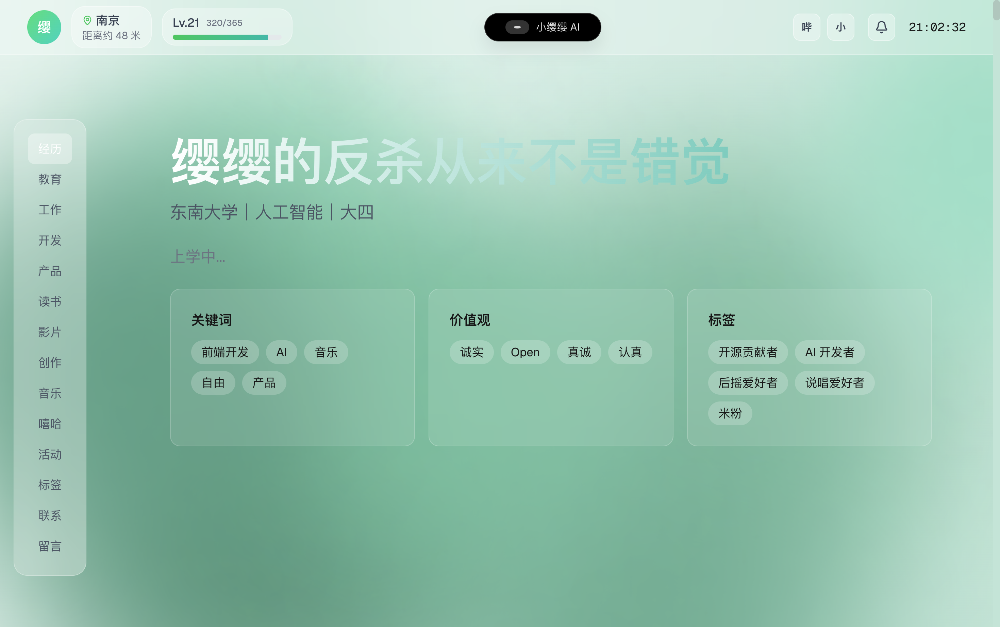
</div>

<!-- 问答：每对问答同一行，整行居中，占满宽度 -->
<div style="display:flex; width:100%; box-sizing:border-box; justify-content:center; align-items:flex-start; gap:12px; margin:12px 0; text-align:center; flex-wrap:nowrap;">
  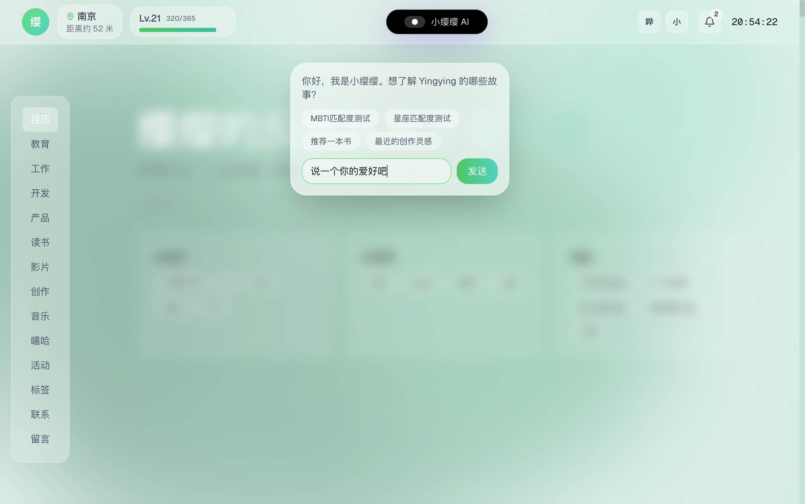
  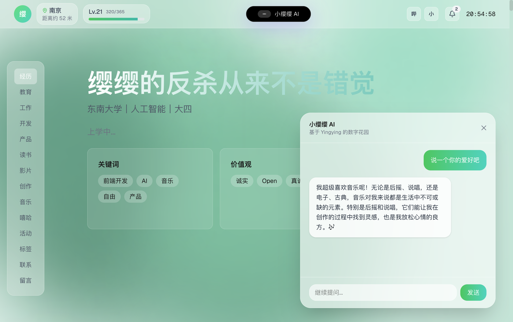
</div>

<div style="display:flex; width:100%; box-sizing:border-box; justify-content:center; align-items:flex-start; gap:12px; margin:12px 0; text-align:center; flex-wrap:nowrap;">
  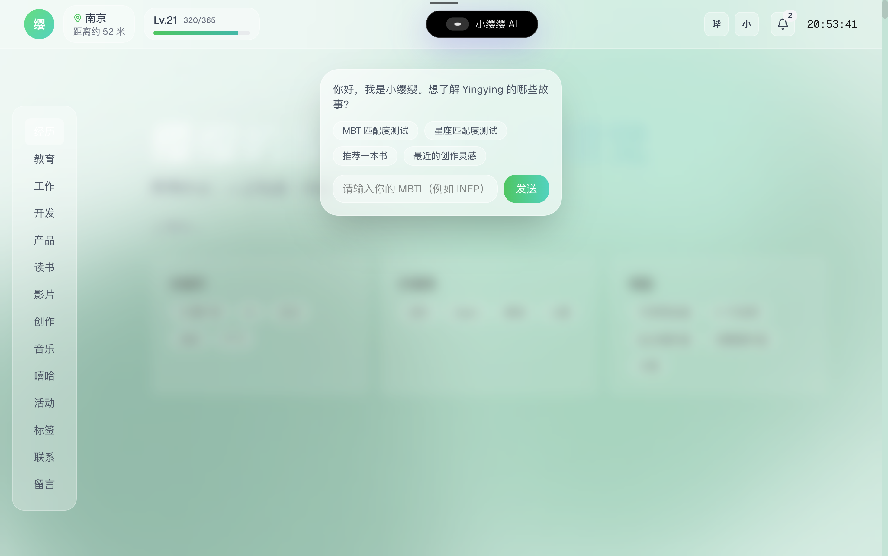
  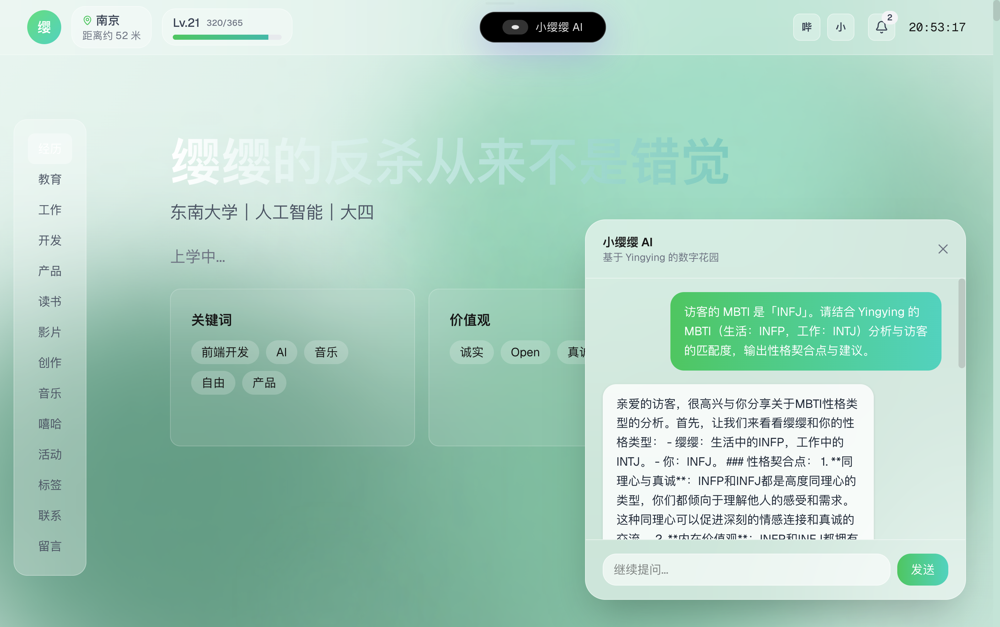
</div>

<!-- 移动端：4张图片同一行，整行居中，占满宽度 -->
<div style="display:flex; width:100%; box-sizing:border-box; justify-content:center; align-items:flex-start; margin:12px 0; text-align:center; flex-wrap:nowrap;">
  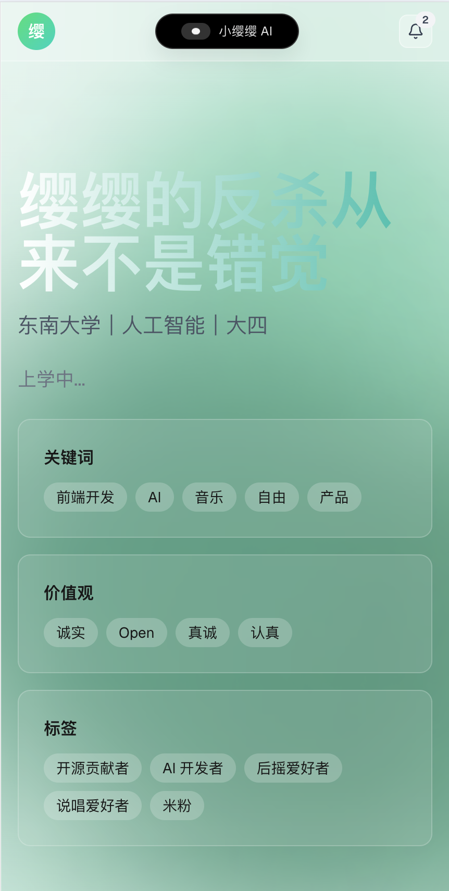
  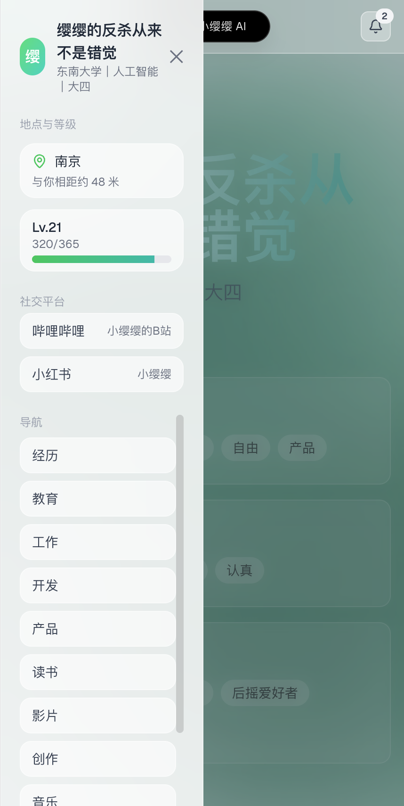
  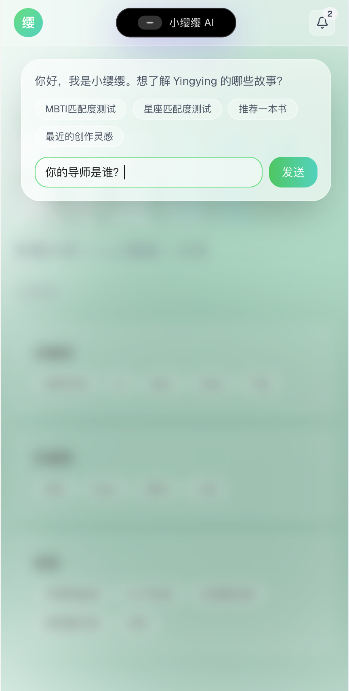
  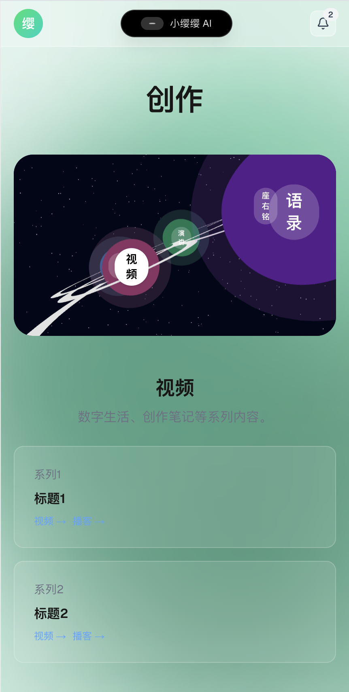
</div>

<!-- 卡片：最后4张分两行，每行2个，整行居中，占满宽度 -->
<div style="display:flex; width:100%; box-sizing:border-box; justify-content:center; align-items:flex-start; gap:12px; margin:12px 0; text-align:center; flex-wrap:nowrap;">
  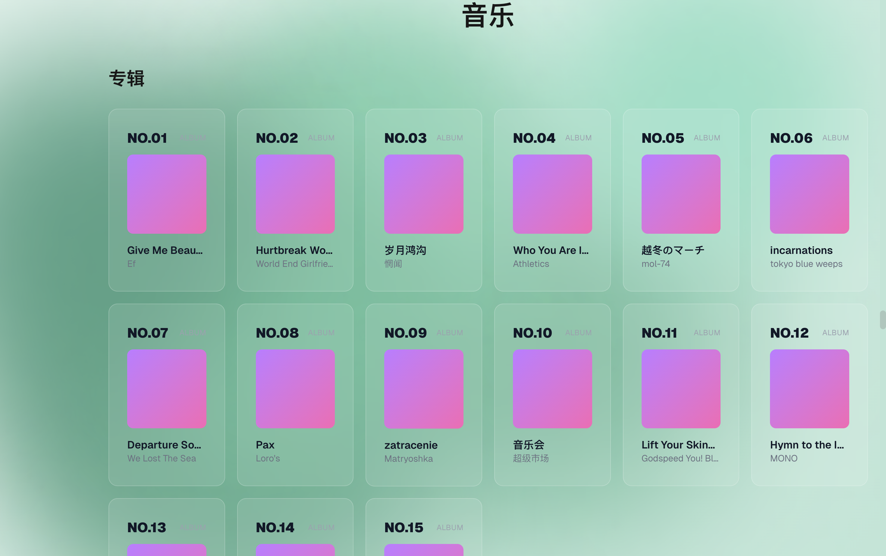
  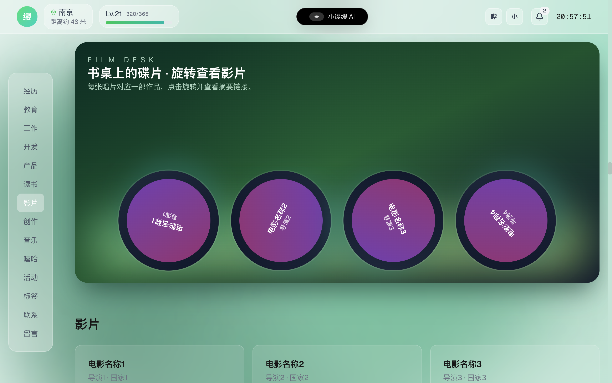
</div>

<div style="display:flex; width:100%; box-sizing:border-box; justify-content:center; align-items:flex-start; gap:12px; margin:12px 0; text-align:center; flex-wrap:nowrap;">
  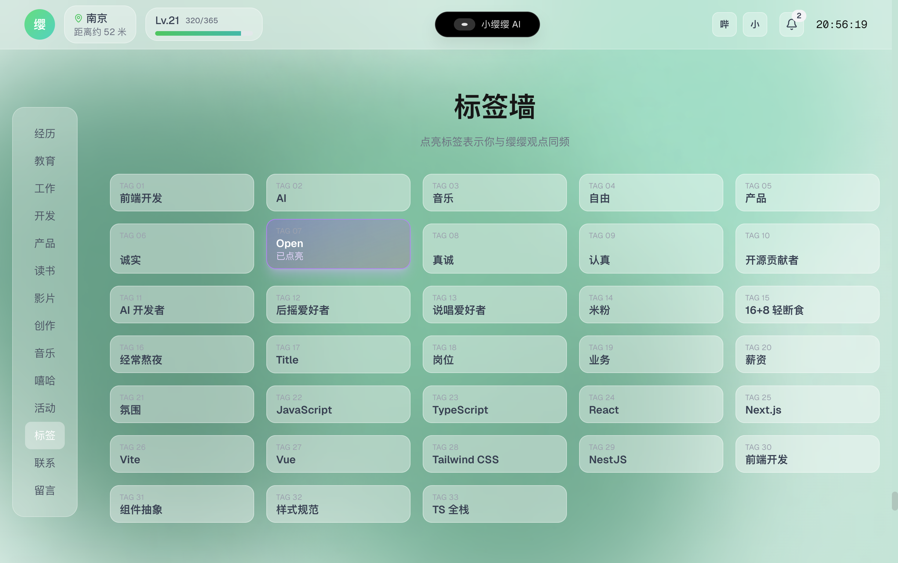
  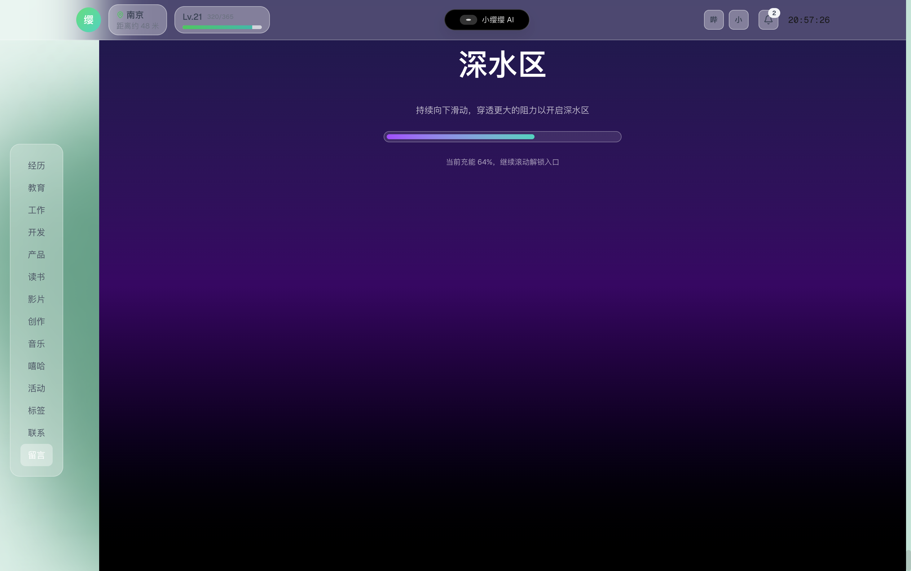
</div>

## 项目亮点

- 数据即内容：所有文案、列表、标签都来自 `data/readme.json`，可离线维护完整的“数字自传”。
- 超过 15 个主题分区：基础信息、生活方式、经历教育、职业偏好、开发项目、产品好物、阅读观影、音乐与嘻哈、活动记录、标签墙、联系卡片、留言板以及彩蛋式深水区。
- 沉浸式视觉体验：Canvas 动态渐变背景、毛玻璃卡片（`GlassCard`）、视差滚动和 Framer Motion 过渡让信息层级一目了然。
- 三维交互：基于 React Three Fiber / drei 的 Product Desk、Creation Galaxy、Reading/Film Desk、Deep Space 等专属场景。
- AI 小缨缨：内置 `/api/assistant` 路由，串流对接智谱 GLM (glm-4-flash)，读取本地 Markdown 化的档案内容进行问答。
- 体验细节：年龄进度条 + 城市定位距离、灵动岛式通知、标签墙点亮、深水区“下拉潜水”机制等互动彩蛋。

## 功能矩阵

### 导航 / 身份

- 顶栏 (`components/TopNav.tsx`) 集成头像、当前位置、时间、通知角标、平台链接、距离计算、年龄进度条与 AI 助手弹窗。
- 侧边锚点 (`components/SideNav.tsx`) 监听滚动并与深水区联动，自动高亮当前版块。

### 主题分区

- `components/sections` 下的 17+ 区块将 `ReadmeData` 映射为不同布局：如经历瀑布流、开发与活动的不规则卡片、产品/阅读/影片的 3D 书桌、创作的星球切换、音乐/嘻哈横向滚动、标签墙、联系卡片及留言表单等。
- `MessageSection` 目前为前端模拟提交，可在后端接入后扩展。

### 沉浸式体验

- `components/BackGround.tsx` 绘制多 Blob 流动 + 鼠标波纹的 Canvas 背景。
- `components/scenes/*` 提供 Product Desk、Creation Galaxy、Deep Space 等 R3F 场景，并内置交互（点击设备查看产品、拉动把手解锁深水区等）。

## 技术栈

- **框架**：Next.js 15 (App Router, Turbopack Dev Server)
- **语言**：TypeScript 5 + React 19
- **样式**：Tailwind CSS 4（原子级 `@import "tailwindcss"` + `@theme inline`）
- **三维 & 动画**：React Three Fiber、@react-three/drei、Framer Motion
- **图标**：lucide-react
- **数据**：本地 JSON (`data/readme.json`) + TypeScript 类型守护 (`types/index.ts`)

## 项目结构

```
yingyingdontkill
├── app
│   ├── api/assistant/route.ts     # AI 助手接口（GLM 流式回复）
│   ├── globals.css                # Tailwind 4 + 全局样式
│   ├── layout.tsx                 # 根布局、字体与动态 Metadata
│   └── page.tsx                   # 主页面入口，串联所有 Section
├── components
│   ├── BackGround.tsx             # Canvas 动态背景
│   ├── GlassCard.tsx / Modal.tsx  # 设计系统组件
│   ├── sections/*                 # 功能分区
│   └── scenes/*                   # React Three Fiber 场景
├── data/readme.json               # 单一事实来源（内容）
├── lib
│   ├── markdown.ts                # 将档案转 Markdown（AI prompt 用）
│   └── utils.ts                   # 年龄/距离/滚动等工具函数
├── local/getLocation.js           # 通过 IP 获取经纬度的 Node 脚本
├── types/index.ts                 # ReadmeData 类型定义
├── docs/*                         # 额外文档，可用于写作/策划
└── package.json / pnpm-lock.yaml  # 依赖与脚本
```

## 数据驱动内容

- `data/readme.json` 覆盖基础、生活、教育、工作、项目、产品、创作、阅读、影视、音乐、嘻哈、活动、联系、深水区思想与通知等字段。
- `types/index.ts` 对 JSON 结构提供静态约束，确保编辑内容时享受 IDE 自动补全。
- 任何对内容的编辑都无需改动组件：更新 JSON → `pnpm dev` 自动热更新。
- 若需要新增城市以完成距离计算，请同步在 `lib/utils.ts` 的 `cityCoordinates` 中维护经纬度。

## 三维场景与动画

- `components/scenes/ProductDeskScene.tsx`：使用 @react-three/fiber 构建的 3D 书桌；设备点击后触发 `Modal` 展示细节。
- `components/scenes/CreationGalaxy.tsx`：星球轨道/颜色根据分类动态生成，可拓展至真实创作数据。
- `components/scenes/DeepSpaceScene.tsx`：深水区背景，与 `DeepWaterSection` 的拖拽手势联动。
- 所有场景默认禁用缩放/平移以保持视觉一致，如需解锁 OrbitControls 交互，可在对应组件中修改 props。

## AI 小缨缨助手

- 接口：`app/api/assistant/route.ts`。
- 行为：读取本地档案并通过 `lib/markdown.ts` 转 Markdown，作为 system prompt 调用 `glm-4-flash`，以 SSE 形式推送回复。
- 环境变量：在 `.env.local` 中配置 `OPENAI_API_KEY`。
- 前端：`TopNav` 中的灵动岛 UI 负责展示 Docked/Floating 状态、建议问题、串流内容与报错提示。

### 运行所需环境变量

```
OPENAI_API_KEY=xxxxxxxxxxxxxxxx
```

若暂不启用 AI，可缺省该变量，前端会提示“服务不可用”并继续运行其他功能。

## 本地开发

1. **环境**：Node.js ≥ 20，推荐使用 `pnpm`（锁文件已提供）。
2. **安装依赖**
   ```bash
   pnpm install
   ```
3. **启动开发服务器**
   ```bash
   pnpm dev
   ```
   - 默认地址：<http://localhost:3000>
4. **检查与构建**
   ```bash
   pnpm lint     # ESLint (Next.js preset)
   pnpm build    # 生产构建
   pnpm start    # 运行产物
   ```

## 内容更新流程

1. 更新 `data/readme.json`，维持与 `types/index.ts` 一致的结构。
2. 若增加新字段：
   - 更新 `types/index.ts`。
   - 在需要展示的 Section 中读取新字段。
   - 如需被 AI 使用，记得同步修改 `lib/markdown.ts`。
3. （可选）在 `docs/` 记录调研或脚本，用于后续版本的内容扩展。

## 组件与设计规范

- `GlassCard`：统一的毛玻璃卡片，默认带 hover 动效，可通过 `hover={false}` 关闭。
- `Modal`：支持居中和右上两种定位，TopNav/产品弹窗均依赖该组件。
- `OverflowTooltip`：用于截断文本的 hover 展示（可在多行列表中复用）。
- 留言区目前为前端表单校验示例，可改造成真正的后端 API（POST /api/messages）。

## 实用脚本

- `local/getLocation.js`：Node 脚本，通过 `ip-api.com` 获取公网 IP 对应的经纬度，方便在 `lib/utils.ts` 或数据源里调试定位相关功能。

## Roadmap / 待办

- [ ] 将所有图片存储在云存储图床服务并给每张图片设唯一文件名，以便组件渲染时直接通过 JSON 中与该文件名一致的“name”类字段访问图片，无需额外新增存储文件名与链接对应的字段。
- [ ] 教育 & 工作区的 2D/3D 场景细化（目前为栅格占位，可迁移到 `components/scenes`）。
- [ ] 深水区宇宙飞行器 / 互动彩蛋进一步打磨。
- [ ] AI 问答接入记忆 / 多模型策略，并允许访客上传提问上下文。
- [ ] 留言板后端化，支持邮件通知或数据库存档。
- [ ] 统一的内容编辑面板（例如 CMS 或 CLI）以生成 `readme.json`。

## 部署提示

- 任何支持 Next.js 15 的平台（Vercel、Netlify、Node 服务器等）均可部署。
- 若部署在无服务器平台，请确保环境变量 `OPENAI_API_KEY` 已配置，且目标平台允许访问 `https://open.bigmodel.cn/`。

## 许可证

[MIT](LICENSE)

## 作者

YingYingDontKill
